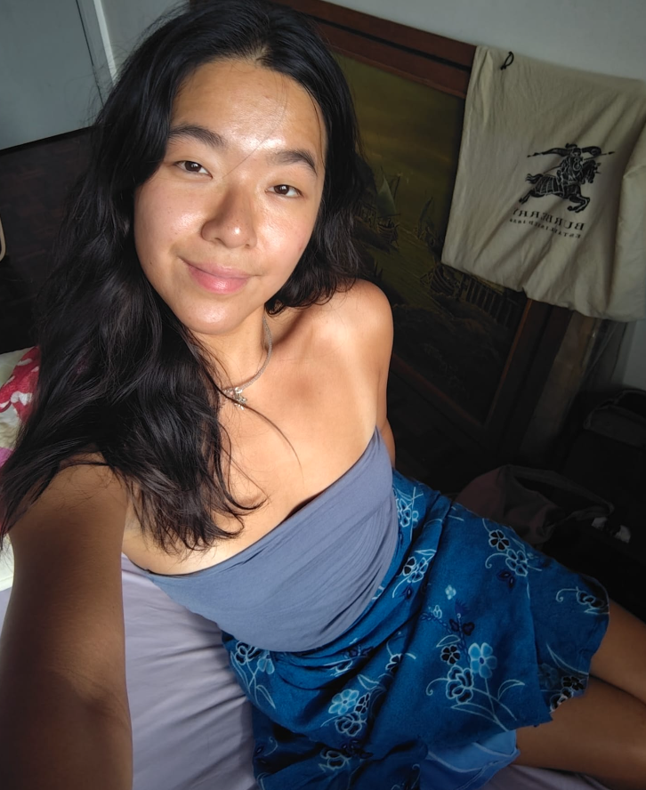

  
  

    <h2>About Me</h2>
    

      Hi! I'm Anabel! I graduated from my Masters in Computational Statistics and Machine Learning with Distinction @
      <a href="https://www.ucl.ac.uk/" target="_blank" rel="noopener">UCL</a>.
      I hold a Bachelors degree from
      <a href="https://www.ed.ac.uk/" target="_blank" rel="noopener">University of Edinburgh</a>.
    

  

<h2>News</h2>
<ul class="news-list">
  <li>
    <strong>Mar 9, 2026:</strong>
    Researching expressitivity of probabilistic circuits with
    <a href="https://liuanji.github.io/" target="_blank" rel="noopener">
      Anji Liu 
    </a>
    at
    <a href="https://nus.edu.sg/" target="_blank" rel="noopener">
      National University of Singapore
    </a>
  </li>
  <li>
    <strong>Sept 29, 2025:</strong>
    <a href="https://arxiv.org/abs/2507.13704" target="_blank" rel="noopener">
      Bayesian Optimization for Molecules should be Pareto-aware
    </a>
    accepted as a poster at
    <a href="https://openreview.net/group?id=NeurIPS.cc/2025/Workshop/AI4Science#tab-your-consoles" target="_blank" rel="noopener">
      NeurIPS 2025: AI4Science Workshop
    </a>.
  </li>
  <li>
    <strong>May 2, 2025:</strong>
    Visiting
    <a href="https://www.comp.nus.edu.sg/~scarlett/index.html" target="_blank" rel="noopener">
      Jonathan Scarlett
    </a>
    at
    <a href="https://nus.edu.sg/" target="_blank" rel="noopener">
      National University of Singapore
    </a>
    to design Bayesian optimization algorithms for molecules.
  </li>
  <li>
    <strong>May 30, 2024:</strong>
    Interned at
    <a href="https://ignotalabs.ai/" target="_blank" rel="noopener">IgnotaLabs.AI</a>
    on Gaussian Processes + Multi-Objective Bayesian Optimization with
    <a href="https://www.austintripp.ca/" target="_blank" rel="noopener">Austin Tripp</a>,
    <a href="https://tbrx.github.io/" target="_blank" rel="noopener">Brooks Paige</a>,
    and
    <a href="https://www.alumni.cam.ac.uk/experimental-spirit-layla-hosseini-gerami" target="_blank" rel="noopener">
      Layla Hosseini-Gerami
    </a>.
  </li>
</ul>

<h2>Contact</h2>
<ul class="contact-list">
  <li><strong>Email:</strong> <a href="mailto:ay180501@gmail.com">ay180501@gmail.com</a></li>
  <li><strong>GitHub:</strong> <a href="https://github.com/anabelyong">github.com/anabelyong</a></li>
  <li>
    <strong>Read my Substack:</strong> 
    <a href="https://substack.com/@bananabelyong">Anabel's Substack</a>
    (blog for my life experiences✨)
  </li>
</ul>
