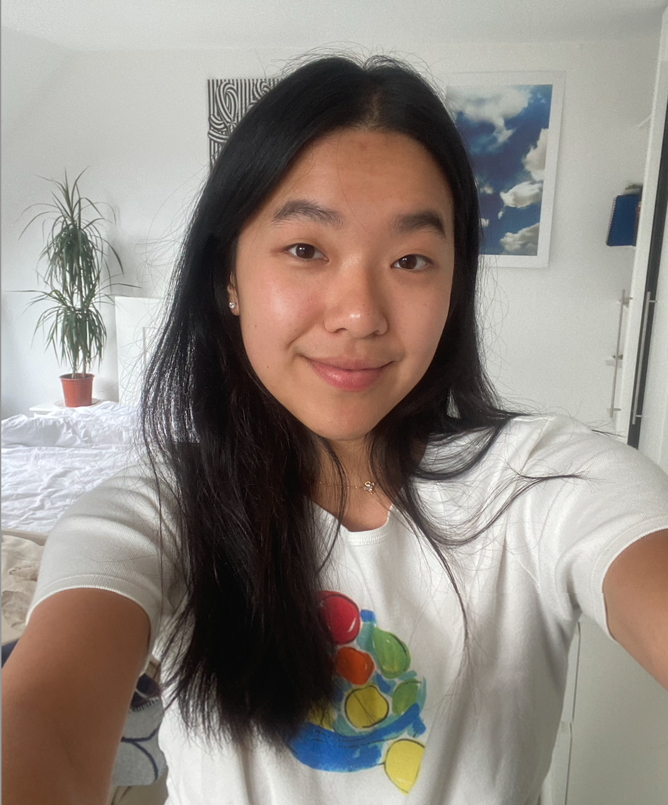

## About Me

Hi! I'm Anabel. I've recently graduated from my Masters in Computational Statistics and Machine Learning with Distinction @ [UCL](https://www.ucl.ac.uk/). I graduated with 1st Class  Honours in Mathematics & Biology at [University of Edinburgh](https://www.ed.ac.uk/). 

I am interested in probabilistic machine learning, machine learning for drug discovery and learning biological data! Current specific machine learning interests include kernel methods, gaussian processes and multi-objective bayesian optimization methods. 

For more details about me, click on my **resume (updated as of October 2024).**

## Current Machine Learning Research
**Visiting Scholar in Machine Learning @ [National University of Singapore](https://nus.edu.sg/)**
- under supervision by [Jonathan Scarlett, NUS](https://www.comp.nus.edu.sg/~scarlett/index.html)
- Working on probabilistic ML approaches to learn mutation data. 

**Machine Learning Research Intern @ [IgnotaLabs.AI](https://ignotalabs.ai/)**
- under supervision by [Brooks Paige, UCL](https://tbrx.github.io/), Layla Hosseini-Gerami and [Austin Tripp, University of Cambridge](https://www.austintripp.ca/)
- Developed a novel Gaussian Process Bayesian Optimization algorithm modelling each molecular property independently using Tanimoto Kernel GPs 
- Working on Tanimoto Kernel methods to handle molecular fingerprints and multi-objective optimization problems such as Expected Hypervolume Improvement

## Contact Details 
- **UCL Email:** [ucabyon AT ucl.ac.uk](mailto:ucabyon@ucl.ac.uk)
- **Personal Email:** [banana180501 AT gmail period com]
- **GitHub:** [/anabelyong](https://github.com/anabelyong)
  
