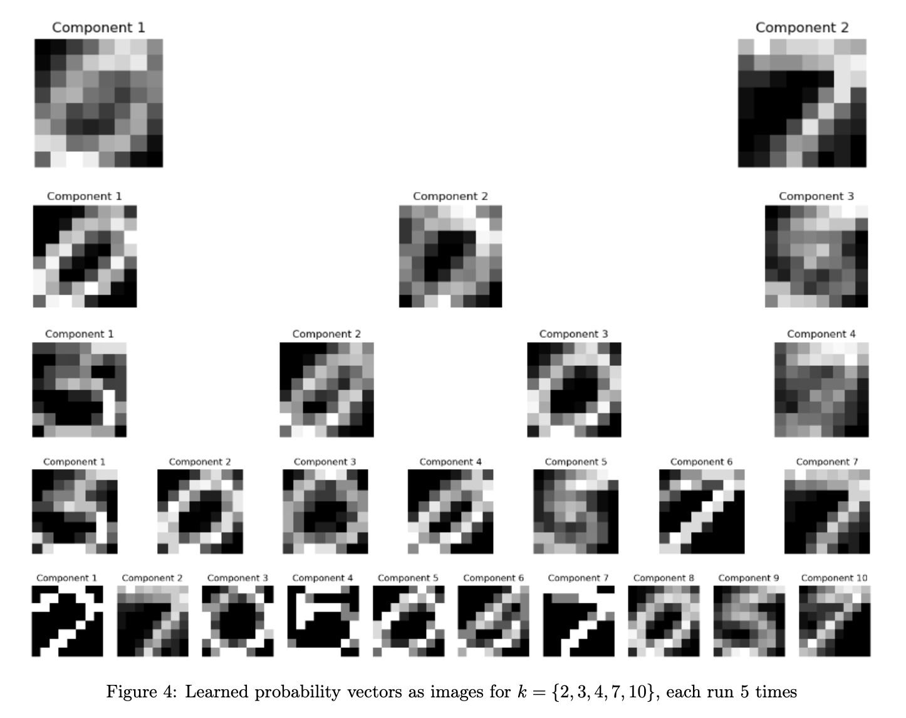
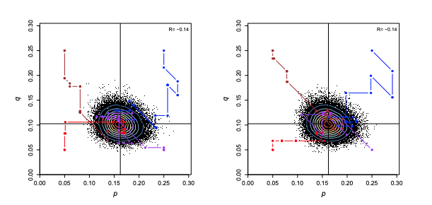
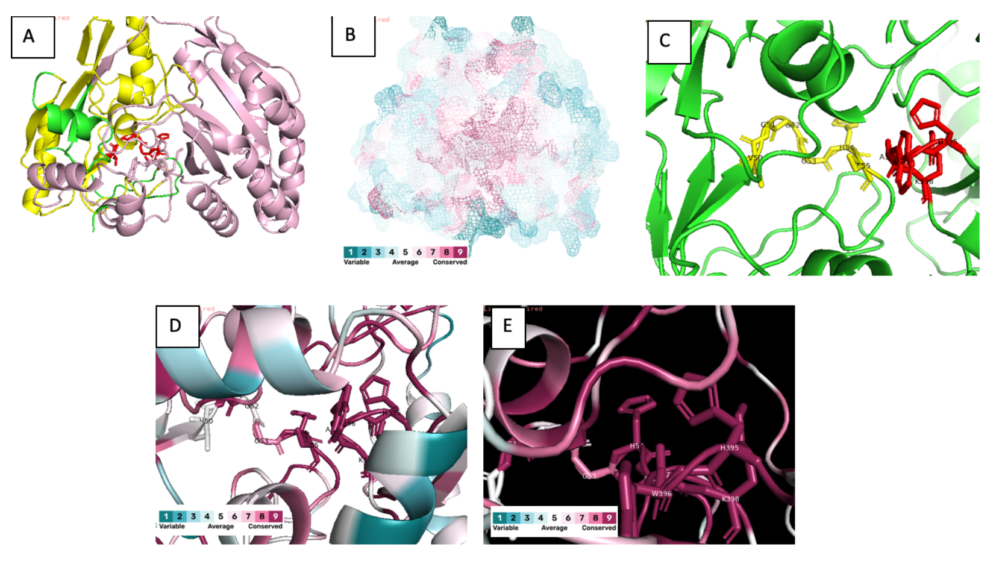
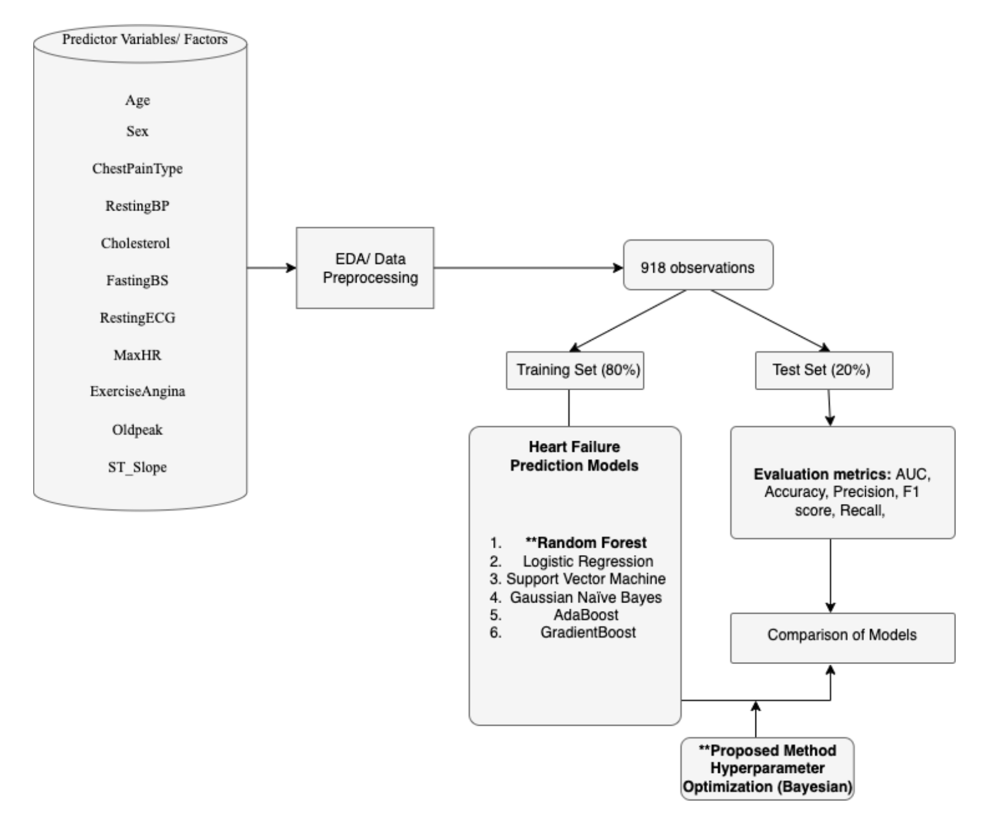

# Current Highlights

Here's a selection of projects that I've worked on. For each project, I've included a brief description, some of the technologies used, and links to view more details or the source code.

## Probabilistic and Unsupervised Learning 

**Description:** Arguably the most interesting and difficult machine learning I have done! This spands from probabilistic modelling with multivariate Gaussians, model selection, expectation maximisation algorithm with binary data, linear gaussian state space models (LGSSMs), Monte Carlo Markov Chain methods (MCMC) for message decryption, Gibbs sampling with latent distributed allocation, and optimization problems. A course requirement for [Gatsby Computational Neuroscience Unit PHD module](https://www.ucl.ac.uk/gatsby/gatsby-computational-neuroscience-unit)
- **Technologies used:** Python, MATLAB, Stata
- **Skills attained:** Unsupervised Learning, Bayesian Statistics, Graphical Models (Markov networks and Bayesian networks) 
- **[View Project](/documents/PUSL_23205123(1).pdf)**
- **[Source Code](https://github.com/anabelyong/probabilistic-unsupervised-learning)**

## Evaluation of False Discovery Rate approaches in large-scale proteomics data

**Description:** Here, we mathematically investigated different false discovery rate approaches for the identification of proteins and microproteins in ProteomeHD2, which is curated by SILAC quantitation from mass spectrometry. This was processed through bio-softwares MaxQuant, Percolator and Fragpipe to process mass spectrometry fragments from wet-lab experiments (SILAC-based MS). The pgFDR tool was optimized here to maximise the detection of true proteins. Performance of pgFDR tool increased to 58% in ProteomeHD2, created by Georg Kustatscher.[Nature link](https://www.nature.com/articles/s41587-019-0298-5)
- **Technologies used:** Python, R
- **Skills attained:** Bioinformatics, Data Visualisation, Statistical Analysis, Mass spectrometry-based proteomics, machine learning (PCA, t-SNE), Data Extraction Pipeline Development
- **[View Project](/documents/dissertation.pdf)**
- **[Source Code](https://github.com/anabelyong/FDREvaluationProteomeHD2)**
  
# My Past Projects
## Bayesian MCMC for ABO Blood Fequency Modelling

**Description:** Estimation of allele frequencies in the ABO blood group, The ABO blood type is determined by the presence or absence of the A and B antigens on erythrocytes. It is controlled by a single gene (the ABO gene) with three alleles: I^A, I^B, and i. Here I stands for isoagglutinogen or antigen, while i means absence of either antigen. For convenience we write the three alleles as A,B, and O. As both A and B alleles are dominant over O, genotypes AA or AO both have the same phenotype (type A), and individuals with BB
or BO have type B. At Hardy-Weinberg equilibrium, the genotype and phenotype frequencies are given as functions of the frequencies of the three alleles, p, q, and r = 1− p−q. The data, X = (nA,nB,nAB,nO), are counts of the four blood types. 
- **Technologies used:** Python, R
- **Skills attained:** Statistical Analysis, Hypothesis Testing, Bayesian Modelling
- **[View Project](/documents/GeneCountingAlgorithmReport.pdf)**
- **[View Project 2](/documents/ABO-ML-MCMC.pdf)**
- **[Source Code](https://github.com/anabelyong/Monte-Carlo-Markov-Chain-methods)**

## Using Structural Bioinformatics Approach for GULO functionality

**Description:** Vitamin C is an important cofactor in many important physiological processes. Vitamin C deficiency usually leads to diseases such as scurvy.The GULO gene encodes an enzyme which converts L-gulono-1,4-lactone to L-ascorbate (vitamin C). GULO enzyme (L-gulonolactone oxidase) is required in the terminal step of catalytic reaction. Members of this enzyme fam- ily contain two important domains: FAD-binding domain and ALO domain. Here demonstrates a structural bioinformatics and functional genomics approach to determine the functionality of GULO gene in certain species.
- **Bioinformatics Software & Databases Utilized:** PYMOL, CONSURF, UniProt, ProteinDataBank(PDB), GenBank, NCBI Blastn, Blastp, tBlastn
- **Skills attained:** Statistical Analysis, Hypothesis Testing, Biochemistry, Gene Ontology
- **[View Project](/documents/GULO_Bioinformatics.pdf)**

## Random Forest with Bayesian Optimisation for Heart Failure Prediction 

**Description:** One tool that has been used to address this is machine learning (ML). ML has attempted to detect heart disease in previous cases drawing significant attention in medical diagnostics. This is because ML can recognize patterns that are not immediate to human practitioners, by handling large volumes of data, and navigating the complex interactions of the numerous factors associated with heart failure. One such ML model implemented, is the Random Forest (RF) model. Within this study, we explore the reliability of RF for predicting heart failure considering data quality, feature engineering, model performance and hyperparameter tuning with Bayesian Optimisation.
- **Technologies used:** Python, Kaggle for obtaining clinical dataset
- **Skills attained:** Feature engineering, Feature Selection, Supervised Learning, Statistical Analysis, Data Visualisation
- **[View Project](/documents/AI4BH_CW1_23205123.pdf)**
- **[Source Code](https://github.com/anabelyong/AI4BH)**

For inquiries or further information about my work, feel free to [email me](mailto:ucabyon@ucl.ac.uk) or check out my [GitHub profile](https://github.com/anabelyong).
