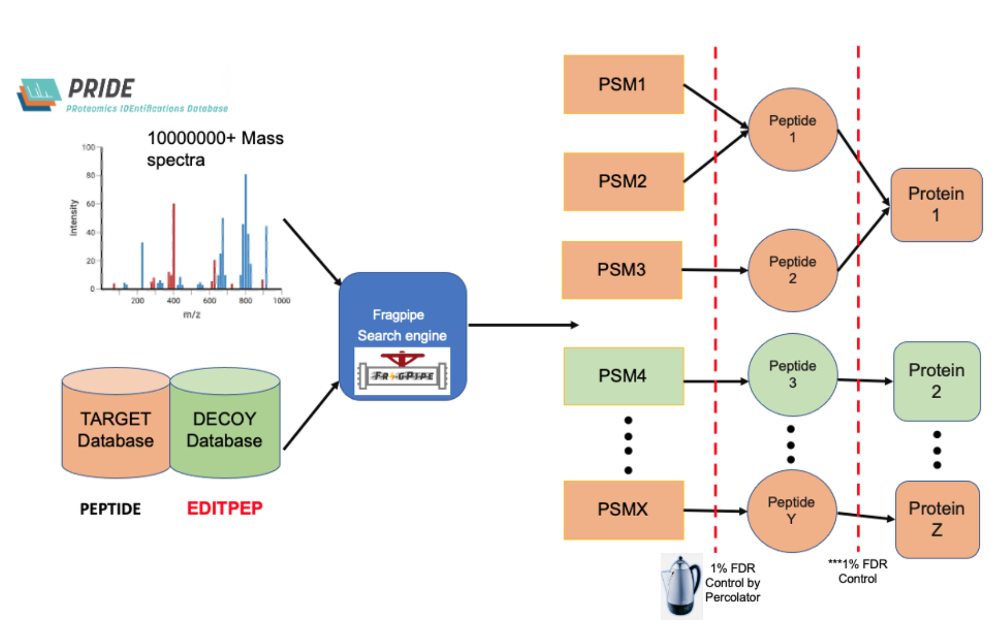
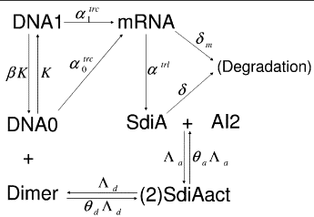

## Research Experiences

**Computational Biologist @ University of Edinburgh, under supervision of [Professor Georg Kustatscher](https://www.ed.ac.uk/biology/wcb/research/research-group-leaders/georg-kustatscher) and Matthew The, Technical University of Munich**
- Optimised data preprocessing tool for combining multiple large-scale MaxQuant searches on protein group-level [pgFDR](https://github.com/kusterlab/picked_group_fdr), which let to discovering 7000+ novel microproteins
- Implemented this tool for accurate & sensitive protein group FDR method on MaxQuant and Fragpipe database
outputs with protein isoforms on ProteomeHD2 dataset curated by Professor Georg Kustatscher
- Controlled false discovery rate for feature selection in human MS-based proteomics dataset (size: 27.1 Gb)

**Statistical Geneticist @ UCL Centre of Computational Biology, under supervision of [Professor ZiHeng Yang and Tomas Fluori](http://abacus.gene.ucl.ac.uk/)**
- Developed statistical models for predictive phylogenetic analysis on blood allele frequencies provided in a small
dataset.
- Implemented Bayesian MCMC algorithm to sample probability distributions in p, q, and r frequencies from
Hardy-Weinberg principle.

**Mathematical Biologist @ Centre for Systems Biology Edinburgh, under supervision of [Professor Ramon Grima](https://grimagroup.bio.ed.ac.uk/ramon-grima)**
- Developed stochastic models (stochastic simulation algorithm) & deterministic models to analyse and predict
complex data patterns in mRNA decay biochemical kinetics.
- Conducted extensive research in Continuous Time Markov Chain processes for sampling functional Kolmogorov
Forward Equations (chemical Master Equation).
- Applied Gibbs sampling (MCMC) and Metropolis Hastings algorithm to investigate consistent genes in the
bipartite network

## Previous work (View Projects for Softwares and Tools Utilized)
1. Evaluation of different False discovery rate approaches in Large-scale Proteomics Data \\
Bachelor's Thesis, supervised by [Georg Kustatscher](https://www.ed.ac.uk/biology/wcb/research/research-group-leaders/georg-kustatscher). \\
_Achieved an 80% (A2)_. \\
[View PDF →](/documents/dissertation.pdf)  

2. Random Forest with Bayesian Optimisation for Heart Failure Prediction \\
[View PDF →](/documents/AI4BH_CW1_23205123.pdf)

3. Using structural bioinformatics approach for GULO functionality \\
_Achieved a 95% (A1)_. \\
[View PDF →](/documents/GULO_Bioinformatics.pdf)
 
4. Purification and Quantification of protein-DNA interactions of Minichromosome
Maintenance Protein (MCM) of Pyrococcus abyssi \\
_Achieved a 90% (A1)_. \\
[View PDF →](/documents/MCM_Protein_Project.pdf)

5. DNMT1 methylates hemi-methylated CpGs but not un- methylated CpGs
[View PDF →](/documents/Structural_Bioinformatics_Project1.pdf)
